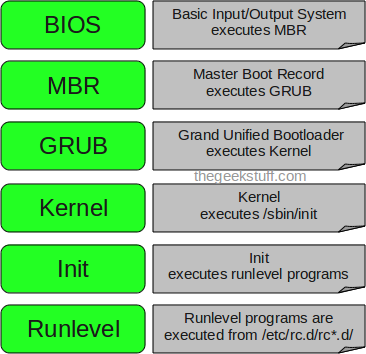

# Introduction to the Linux boot and startup processes

In this article we discuss what happens behind the scenes from the time you press the power button until the linux login prompt appears?

In reality, there are two sequences of events that are required to boot a Linux computer and make it usable: **boot** and **startup**. The boot sequence starts when the computer is turned on, and is completed when the kernel is initialized and systemd/systemv is launched. The startup process then takes over and finishes the task of getting the Linux computer into an operational state.

The following are the 6 high level stages of a typical Linux boot process.

## Power Supply & SMPS (Switching Mode Power Supply)

The primary objective of this component is to provide the perfect required voltage level to the motherboard and other computer components. SMPS converts AC to DC and maintain the required voltage level so that the computer can work flawlessly.

But the main task performed by SMPS, is to inform about the good power supply. As soon as you supply power to the computer, the SMPS checks the voltage level's its providing to the motherboard. If the power signal level is perfect, then SMPS will send a POWER GOOD signal to the motherboard timer. On receiving this POWER GOOD signal from SMPS, the motherboard timer will stop sending reset signal to the CPU. Which means the power level is good and the computer can boot.

## Bootstrapping

Something has to be programmed by default, so that the CPU knows where to search for instructions. **This is an address location in the ROM. **This address location is almost always constant in X86 based computers.  It only contains one instruction. The instruction is to jump to another memory address location. **This JUMP command, will tell the location of the BIOS program in the ROM.  This is how the computer will come to know where the BIOS program is located.**

# 1. BIOS (Basic Input/Output System)

The first step of the Linux boot process really has nothing whatever to do with Linux. This is the **hardware portion of the boot process and is the same for any operating system**. When IBM designed the first PC back in 1981, BIOS was designed to initialize the hardware components. **POST is the part of BIOS** whose task is to **ensure that the computer hardware functioned correctly**. If POST fails, the computer may not be usable and so the boot process does not continue.

POST is very important thing to have before the Operating system is loaded. Just imagine if you have a faulty hard drive or faulty memory, sometimes these things can cause data loss. POST checks and confirms the integrity of the following hardware components.

*   Timer IC's
*   DMA controllers
*   CPU
*   Video ROM

 

A full POST check will confirm the integrity of the following devices as well.

*   Motherboard
*   Keyboard
*   Printer port
*   Hard Drive etc

 

If you are doing a warm start (which means you did a reset of a running machine), a full POST check will not be conducted by the BIOS. However if you are doing a Cold Start, which means you have applied the power now, it will conduct a full POST. BIOS determines whether its a cold or warm start, by looking at a flag in a predefined memory location. Once the POST check is completed successfully, **_BIOS will look CMOS settings to know what is the boot order._** Boot order is nothing but a user defined order which tells where to look for the operating system.

 

The order will be something like the below.

1.  CD ROM
1.  HARD DISK
1.  USB

 

The above shown order means that the BIOS will look at CD ROM first to check whether an OS can be loaded from there, if it does not find a bootable disk in the CD ROM, it will look check whether a bootable OS is there in the hard disk, then USB. Let's assume that you don't have a bootable CD in your CD ROM drive, then the BIOS will turn to HARD disk.

Summary

*   Performs some system integrity checks.
*   **Searches, loads, and executes the boot loader program**
*   It looks for boot loader in floppy, cd-rom, or hard drive. You can press a key (typically F12 of F2, but it depends on your system) during the BIOS startup to change the boot sequence.
*   Once the boot loader program is detected and loaded into the memory, BIOS gives the control to it.
*   So, in simple terms BIOS loads and executes the MBR boot loader.

# 2. MBR

root@ubuntu-dev:~# **dd if=/dev/sda of=mbr bs=512 count=1**

1+0 records in

1+0 records out

512 bytes (512 B) copied, 0.000134061 s, 3.8 MB/s

What the above command does is to simply dump the contents of your first sector which of 512 bytes to a file named mbr. bs in the above command stands for block size. And count means to dump only the first sector (the dump will start from the beginning of the hard disk, and the size is 512 bytes).

Read more about dd command at [https://www.linuxnix.com/what-you-should-know-about-linux-dd-command/](https://www.linuxnix.com/what-you-should-know-about-linux-dd-command/).

The MBR contains the** first stage of the grub**, and partition table information.

*   MBR stands for **Master Boot Record**.
*   It is **located in the 1st sector** of the bootable disk. Typically /dev/hda, or /dev/sda
*   **MBR is less than 512 bytes in size. This has three components 1) primary boot loader info in 1st 446 bytes 2) partition table info in next 64 bytes 3) mbr validation check in last 2 bytes.**
*   It **contains information about GRUB** (or LILO in old systems).
*   So, in simple terms **MBR loads and executes the GRUB boot loader**.

# 3. GRUB

GRUB2 stands for "**GRand Unified Bootloader**, version 2" and it is now the primary bootloader for most current Linux distributions. **GRUB2 is the program which makes the computer just smart enough to find the operating system kernel and load it into memory.**

*   If you have multiple kernel images installed on your system, you can choose which one to be executed.
*   GRUB displays a splash screen, waits for few seconds, if you don't enter anything, it loads the default kernel image as specified in the grub configuration file.
*   GRUB has the knowledge of the filesystem (the older Linux loader LILO didn't understand filesystem).
*   Grub configuration file is **/boot/grub/grub.conf** (/etc/grub.conf is a link to this). The following is sample grub.conf of CentOS.
*   #boot=/dev/sda \
default=0 \
timeout=5 \
splashimage=(hd0,0)/boot/grub/splash.xpm.gz \
hiddenmenu \
title CentOS (2.6.18-194.el5PAE) \
          root (hd0,0) \
          kernel /boot/vmlinuz-2.6.18-194.el5PAE ro root=LABEL=/ \
          initrd /boot/initrd-2.6.18-194.el5PAE.img
*   As you notice from the above info, **it contains kernel and initrd image**.
*   So,** in simple terms GRUB just loads and executes Kernel and initrd images.**

GRUB must be located in the space between the boot record itself and the first partition on the disk drive. This space was left unused historically for technical reasons. The **first partition on the hard drive begins at sector 63 and with the MBR in sector 0**, that leaves 62 512-byte sectors—31,744 bytes—in which to store the **core.img file which is stage 1.5 of GRUB**. The core.img file is 25,389 Bytes so there is plenty of space available between the MBR and the first disk partition in which to store it.

Because of the larger amount of code that can be accommodated for **stage 1.5**, it can **have enough code to contain a few common filesystem drivers, such as the standard EXT and other Linux filesystems, FAT, and NTFS.** This means that stage 2 of GRUB2 can be located on a standard EXT filesystem but it cannot be located on a logical volume. So **the standard location for the stage 2 files is in the /boot filesystem, specifically /boot/grub2.**

Note that the **/boot directory must be located on a filesystem that is supported by GRUB. Not all filesystems are.** The **function of stage 1.5 is to begin execution with the filesystem drivers necessary to locate the stage 2 files in the /boot filesystem and load the needed drivers.**

# 4. Kernel

*   **Mounts the root file system** as specified in the "root=" in grub.conf
*   **Kernel executes the /sbin/init program**
*   Since init was the 1st program to be executed by Linux Kernel, it has the process id (PID) of 1. Do a 'ps -ef | grep init' and check the pid.
*   **initrd stands for Initial RAM Disk**.
*   **initrd is used by kernel as** **temporary root file system until kernel is booted and the real root file system is mounted.** **It also contains necessary drivers compiled inside, which helps it to access the hard drive partitions, and other hardware.**

# 5. Init

*   **Looks at the /etc/inittab file to decide the Linux run level**.
*   Following are the available run levels
    *   0 – halt
    *   1 – Single user mode
    *   2 – Multiuser, without NFS
    *   3 – Full multiuser mode
    *   4 – unused
    *   5 – X11
    *   6 – reboot
*   **Init identifies the default initlevel from /etc/inittab** and uses that to load all appropriate program.
*   Execute 'grep initdefault /etc/inittab' on your system to identify the default run level
*   Typically you would set the default run level to either 3 or 5.

# 6. Runlevel programs

*   When the Linux system is booting up, you might see various services getting started. For example, it might say "starting sendmail …. OK". Those are the runlevel programs, executed from the run level directory as defined by your run level.
*   Depending on your default init level setting, the system will execute the programs from one of the following directories.
    *   Run level 0 – /etc/rc.d/rc0.d/
    *   Run level 1 – /etc/rc.d/rc1.d/
    *   Run level 2 – /etc/rc.d/rc2.d/
    *   Run level 3 – /etc/rc.d/rc3.d/
    *   Run level 4 – /etc/rc.d/rc4.d/
    *   Run level 5 – /etc/rc.d/rc5.d/
    *   Run level 6 – /etc/rc.d/rc6.d/
*   Please note that there are also symbolic links available for these directory under /etc directly. So, /etc/rc0.d is linked to /etc/rc.d/rc0.d.
*   Under the /etc/rc.d/rc*.d/ directories, you would see programs that start with S and K.
*   **Programs starts with S are used during startup. S for startup.**
*   **Programs starts with K are used during shutdown. K for kill.**
*   **There are numbers right next to S and K in the program names. Those are the sequence number in which the programs should be started or killed.**
*   For example, S12syslog is to start the syslog deamon, which has the sequence number of 12. S80sendmail is to start the sendmail daemon, which has the sequence number of 80. So, syslog program will be started before sendmail.

# systemd

systemd is the mother of all processes and it is responsible for bringing the Linux host up to a state in which productive work can be done. Some of its functions, which are far more extensive than the old init program, are to manage many aspects of a running Linux host, including mounting filesystems, and starting and managing system services required to have a productive Linux host. 

First, systemd mounts the filesystems as defined by /etc/fstab, including any swap files or partitions. At this point, it can access the configuration files located in /etc, including its own. It uses its configuration file, /etc/systemd/system/default.target, to determine which state or target, into which it should boot the host. The default.targetfile is only a symbolic link to the true target file. For a desktop workstation, this is typically going to be the graphical.target, which is equivalent to runlevel 5 in the old SystemV init. For a server, the default is more likely to be the multi-user.target which is like runlevel 3 in SystemV. The emergency.target is similar to single user mode.
